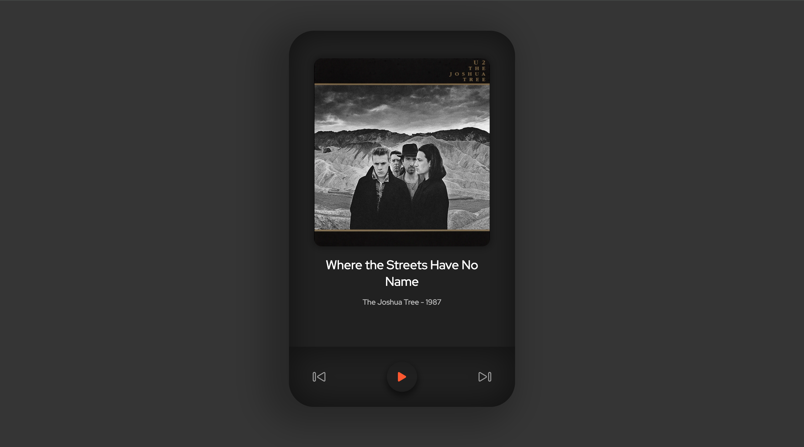

# soundPlay

A simple and lightweight media player built using HTML, CSS, and JavaScript.

## Table of contents

- [Overview](#overview)
  - [Screenshot](#screenshot)
  - [Links](#links)
  - [Built with](#built-with)
- [Author](#author)

## Overview

### Screenshot

### Links

- Live Site URL: [Live Site at Vercel](https://sound-play-three.vercel.app/)

### Built with

- HTML5
- CSS
- javascript
- Responsive Design

## Author

- GitHub - [firoozehImany](https://github.com/firoozehImany)
- Twitter - [firoozehImany](https://www.twitter.com/firoozehImany)